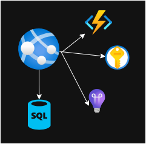

## Azure

Azure is Microsoft's cloud platform for building, running, and managing applications without owning physical servers. Instead of buying hardware, installing data center networking, and planning for peak capacity years in advance, you use Azure services on demand and pay for what you consume.

At a high level, Azure gives you three major advantages:

- :material-speedometer: Speed: Launch infrastructure and applications in minutes.
- :material-scale: Scale: Grow from a small prototype to global production traffic.
- :material-shield: Reliability: Use built-in redundancy, monitoring, and security controls.

## Why Azure Matters

Modern teams need to ship quickly, stay secure, and control cost. Azure helps by providing managed services for common needs:

- Host web apps and APIs
- Store and process data
- Run containers and serverless workloads
- Build AI-enabled features
- Monitor systems and respond to incidents

Because these services are managed, your team spends less time on operations and more time on product delivery.

## Core Building Blocks

When you start with Azure, a few concepts appear everywhere:

- Subscription: A billing and governance boundary.
- Resource group: A logical container for related resources.
- Region: The geographic location where your resources run.
- Resource: Any deployed service, such as a web app, database, or storage account.
- Identity and access: Controls who can do what, usually through Microsoft Entra ID and RBAC.

Think of it this way: a subscription is your account scope, a resource group is your project folder, and resources are the actual cloud components your application depends on.

## Azure Service Categories

Azure has many services, but most projects use a small set from each category:

- Compute: Run code with services like Azure App Service, Azure Functions, Virtual Machines, and Azure Kubernetes Service (AKS).
- Data: Store data in Azure SQL, Azure Cosmos DB, PostgreSQL, and Blob Storage.
- Networking: Secure traffic with Virtual Network, Load Balancer, Application Gateway, and CDN.
- Security: Protect secrets and identities with Key Vault, Defender for Cloud, and RBAC policies.
- Observability: Monitor health and performance using Azure Monitor, Application Insights, and Log Analytics.
- DevOps and automation: Use GitHub Actions or Azure DevOps pipelines for CI/CD and repeatable deployments.

## Common Azure Hosting Models

Most teams choose one of these operating models:

- :material-server:{ .lg .middle } **IaaS (Infrastructure as a Service)**

    ---

     :octicons-paintbrush-16: Example: Virtual Machines. 
         
     :octicons-paintbrush-16: Maximum control, but more operational work.

- :material-function-variant:{ .lg .middle } **Serverless**

    ---

     :octicons-paintbrush-16: Example: Azure Functions. 
      
     :octicons-paintbrush-16: You deploy function code and pay per execution.

- :material-docker:{ .lg .middle } **Containers**

    ---

     :octicons-paintbrush-16: Example: Azure Container Apps or AKS. 
      
     :octicons-paintbrush-16: You package apps as containers and control deployment behavior.

- :material-application-cog:{ .lg .middle } **PaaS (Platform as a Service)**

    ---

     :octicons-paintbrush-16: Example: App Service. 
         
     :octicons-paintbrush-16: Azure manages OS patches, runtime, and scaling.

- :material-cloud-check:{ .lg .middle } **SaaS (Software as a Service)**

    ---

     :octicons-paintbrush-16: Example: Microsoft 365. 
      
     :octicons-paintbrush-16: The provider manages the complete application stack, and you consume the service.

If you are new to cloud architecture, starting with PaaS or serverless usually gives the fastest time to value.

## Cost Model in Simple Terms

Azure follows a consumption model. Instead of one large upfront purchase, cost is based on what you use.

Typical billing dimensions include:

- Compute time (seconds, minutes, or hours)
- Storage volume (GB/TB)
- Requests or transactions
- Data transfer

To stay cost-efficient, teams commonly use:

- Autoscaling
- Reserved capacity for predictable workloads
- Budgets and cost alerts
- Right-sizing of resources

## A Practical Example

- :material-list-box:{ .lg .middle } **Imagine building a small internal dashboard:**

    ---

    1. Host the frontend on Azure Static Web Apps.
    2. Expose backend APIs using Azure Functions.
    3. Store app data in Azure SQL.
    4. Keep secrets in Key Vault.
    5. Add Application Insights for performance and error monitoring.

- :material-pencil-ruler:{ .lg .middle } **Reference architecture diagram:**

    ---

    
     
    

***Reference architecture: Static Web Apps + Functions + Azure SQL + Key Vault + Application Insights.***

This setup can go from local prototype to production with minimal operations overhead.

## Getting Started Path

If you are just beginning with Azure, follow this order:

1. Learn the basics: subscription, resource groups, and regions.
2. Deploy one simple app with App Service or Functions.
3. Add monitoring from day one using Application Insights.
4. Manage infrastructure with IaC tools such as Bicep or Terraform.
5. Automate deployment using CI/CD pipelines.

## Final Takeaway

Azure is not just a place to run servers. It is a complete cloud platform that helps you build secure, scalable, and observable applications faster. Whether you are deploying a simple website, an API platform, or AI-powered systems, Azure provides managed building blocks that let your team focus on delivering business value.

