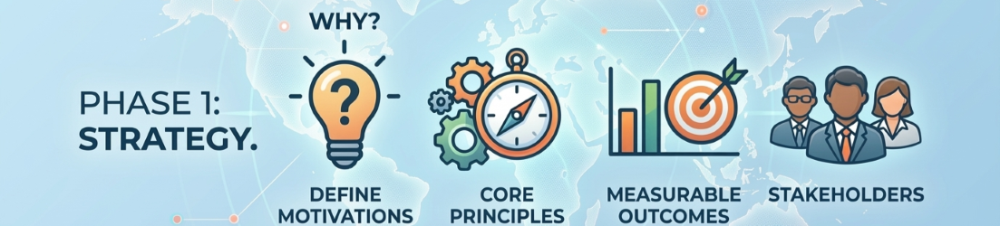
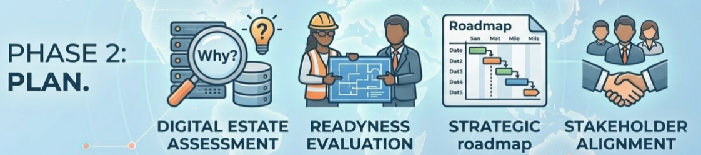
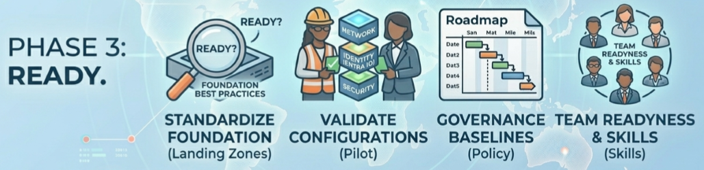
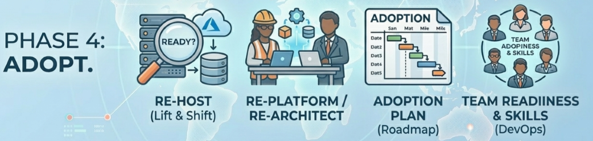
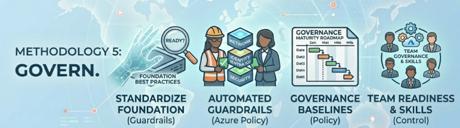
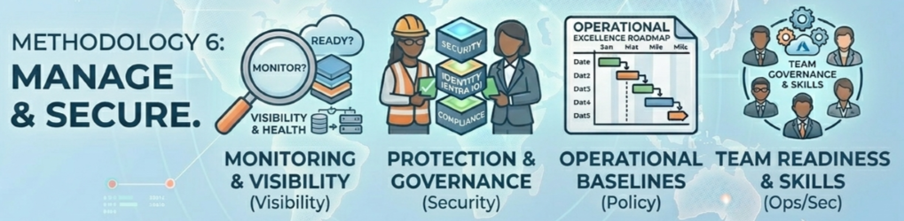
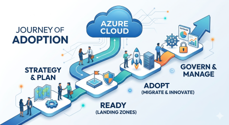

:material-microsoft-azure:{ .lg .middle }
# The Blueprint You Didn't Know You Needed: A Deep Dive into the Microsoft Cloud Adoption Framework for Azure

The “flip-the-switch” :fontawesome-solid-toggle-on: dream of cloud adoption is dead.

By now, most organizations have realized that migrating to Microsoft Azure isn’t just an IT project. It’s a complete business transformation. Yet, despite this awareness, too many companies are still treating their cloud journey like a grocery run:🏃 get in, grab what looks good (virtual machines), get out (back to standard operations), and hope you don't spend too much.

<!-- more -->

**The result? The Cloud Paradox.**

You expected agility, but got buried in administrative complexity. You expected cost savings, but received a quarterly invoice that made you question the wisdom of the entire venture. You expected security, but found yourself drowning in configuration options and unclear governance models.

You expected acceleration, but you’re actually *stalling*.

**The missing ingredient isn’t a new Azure service. It’s a proven roadmap.** That roadmap is the **Microsoft Cloud Adoption Framework (CAF) for Azure**.

CAF is not just technical documentation. It is a comprehensive collection of resources, best practices, tools, and templates gathered from thousands of successful Azure deployments by Microsoft engineers, partners, and customers. It addresses the technical needs, but also—critically—the people and process changes necessary for true cloud maturity.

Let’s break down the journey through the CAF lens.

---

### The CAF Journey: From Strategy to Sustainability

The framework divides the adoption lifecycle into sequential phases, punctuated by operational guardrails. It's not a one-time checklist, but an iterative cycle.

:material-head-question: 
#### Phase 1: Strategy – The "Why" Before the "How" 

>
Ad-hoc migrations fail because they have no business destination. CAF insists you start with **Strategy**.
>
!!!list "Key Elements of the Strategy Phase"
    - [x] **Define Motivations:** Are you reacting to a critical business event (datacenter shutdown)? Looking for cost reduction? Scaling globally? Investing in innovation (AI/analytics)? Your "Why" determines your "How."
    - [x] **Set Measurable Outcomes:** Success must be defined upfront. Think concrete KPIs: "Reduce infrastructure costs by 25%," "Improve uptime to 99.9%," or "Support market expansion into Europe."
    - [x] **Inform Strategic Decisions:** This isn't just an IT meeting. You need executive sponsorship, finance leads, and security professionals at the table from day one.

#### Phase 2: Plan – The Architect’s Blueprint

>
Once you know the destination, you need a map. The **Plan** phase converts business intent into a prioritized roadmap.
>
!!!list "Planning Principles"
    - [x] **Assess Digital Estate:** What do you actually own? You need a detailed inventory of your applications, data, and underlying infrastructure.
    - [x] **Evaluate Readiness:** Are your teams skilled enough? Are your current processes ready for a DevOps-centric model? Plan for upskilling and reskilling.
    - [x] **Build the Roadmap:** Create a timeline and budget. Identify the known unknowns (gaps) before they become mid-project crises.

#### Phase 3: Ready – Building Your Landing Zone

>
You wouldn’t build a house before pouring the foundation. In Azure, this foundation is called an **Azure Landing Zone**. The **Ready** phase is dedicated to establishing this environment.
>
!!!list "Key Principles of the Ready Phase"
    - [x] **Standardize Your Foundation:** A landing zone is a pre-configured, modular environment built according to best practices. It governs things like subscription organization, network connectivity, identity baseline (Entra ID), and logging.
    - [x] **Validate Configurations:** Use pilot deployments to test your landing zone setup. It’s cheaper to fail small here than to fail big mid-migration.
    - [x] **Democratize Subscriptions:** CAF encourages a policy-driven model where teams can request compliant landing zones in a self-service manner, balancing developer speed with operational control.

#### Phase 4: Adopt – Migrating and Modernizing

>
This is where the actual implementation happens. You have two primary paths in the **Adopt** phase:
>
!!!list "Adoption Methodologies"
    - [x] **Migrate:** Methodically lift-and-shift existing workloads to the cloud. Start small to build momentum before expanding.
    - [x] **Innovate:** Modernize existing apps or build cloud-native solutions from scratch (using Kubernetes, serverless architecture, or Azure databases). This is where the true competitive agility lies.

---
!!! tip "The Operational Guardrails: They Don’t Stop When You Launch"
    The first four phases are foundational and sequential. But once your workloads are running in Azure, they need ongoing protection and optimization. This is where CAF integrates the "always-on" operational methodologies.

#### Methodology 5: Govern – The Invisible Hand

>
**Govern** is about establishing guardrails that maintain control without stifling agility.
>
!!!list "Governance Principles"
    - [x] **Assess Cloud Risks:** What are the actual risks to your digital estate? (e.g., cost drift, access risks, compliance violations).
    - [x] **Define Policies & Guardrails:** Use tools like Azure Policy and Azure Blueprints to enforce security baselines, deployment automation standards, and cost limits across your entire environment.
    - [x] **Iterative Maturity:** Governance is not static. Revisit your policies as your adoption scales and your maturity increases.

#### Methodology 6: Manage & Secure – Ongoing Operations

The final stage focuses on continuous operations.
!!!list "Management Principles"
    - [x] **Monitoring:** Use Azure Monitor to get complete visibility into the health of your applications and infrastructure.
    - [x] **Protection:** Leverage Azure’s platform security features and defensive tools (like Microsoft Defender for Cloud) to protect your assets through a defense-in-depth approach.
    - [x] **Optimization:** Continuously assess your environment against the core pillars (Reliability, Security, Cost Optimization, Operational Excellence, Performance Efficiency) to ensure you are maximizing value. 

!!! note "The CAF-WAF Connection" 
    This is where CAF connects directly with the complementary Azure Well-Architected Framework (WAF).

#### The Newer Pillar: Sustainability
:fontawesome-solid-leaf:
> CAF now incorporates **Sustainability** as a critical methodology.

!!! list "Sustainability Principles"
    - [x] **Measure Impact:** Use the Emissions Impact Dashboard to track your carbon footprint.
    - [x] **Optimize Resources:** The most efficient resource is the one you don’t need. Sustainability means eliminating waste, right-sizing workloads, and scaling dynamically. Sustainability and cost optimization often go hand-in-hand.

---

### Stop Guessing. Start Transforming.

If your Azure journey feels complex, chaotic, or costly, it is probably because you are navigating without a framework. The Microsoft Cloud Adoption Framework is designed to give you clarity, structure, and control.

Stop treating the cloud like a fancy datacenter and start leveraging it as a competitive engine. Leverage the CAF roadmap to build a resilient, efficient foundation in Azure that doesn’t just store your data, but actually drives your business forward.

**Your cloud maturity transformation starts now.**