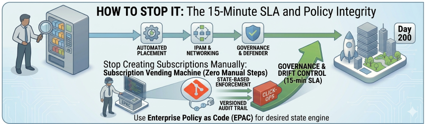
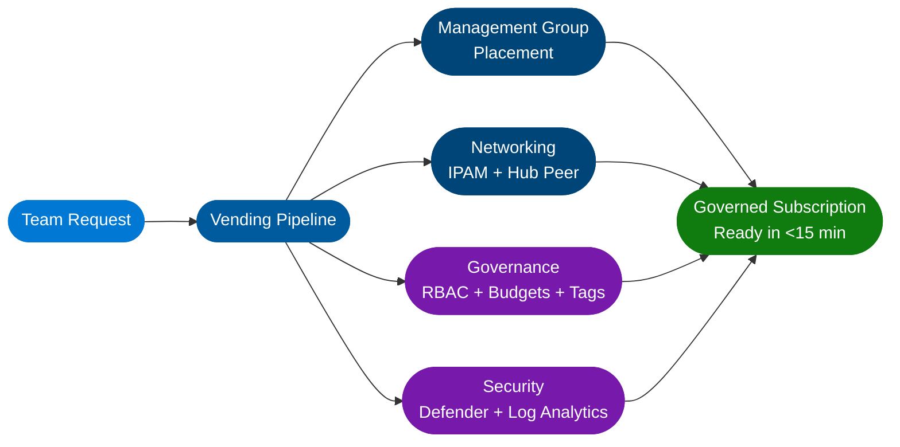
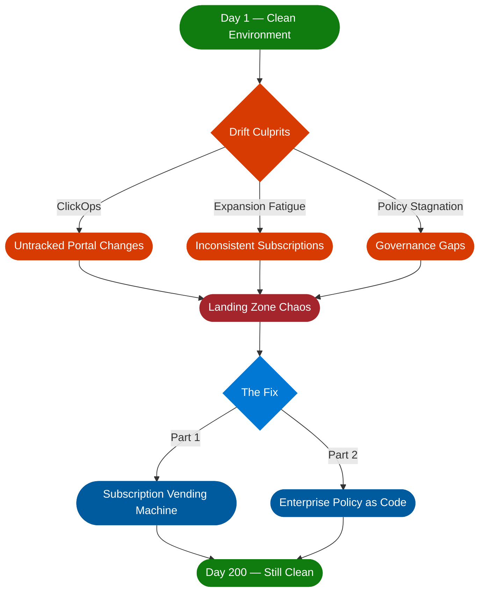

# Beyond the Blueprint: How Landing Zones Decay (And How to Stop It)

There's a moment every cloud architect knows :material-clock-fast:. You've just finished the deployment. Management Groups are clean. Naming conventions are perfect. The Hub-Spoke topology is exactly as the whiteboard promised. You lean back, and for one brief, beautiful moment — it all makes sense.

<!-- more -->

That moment is called **Day 1**.

Now fast-forward six months.

There are orphaned subscriptions with no owner and no cost centre tag. A developer opened RDP "just for an hour" during a production incident and never closed it. Your meticulously designed Enterprise-Scale environment has quietly turned into a digital junk drawer.

Welcome to **Landing Zone Drift** :material-alert: — the thing nobody warns you about in the CAF documentation.

---

## :material-layers-remove: The Uncomfortable Truth About Landing Zones

Here's what most teams get wrong: they treat a Landing Zone as a project with a start date and an end date. You deploy it, hand over the keys, and move on to the next thing.

But a Landing Zone isn't a project. **It's a product.** And like any product, if you stop maintaining it, it rots.

!!! warning "Drift Starts Small — But It Compounds"
    A manual change here. A quick portal click there. A policy exception that was supposed to be temporary. Each one feels harmless in isolation. Together, they quietly unravel everything you built.

The three main culprits of Landing Zone Drift:

-   :material-mouse-outline:{ .lg .middle } **ClickOps**

    ---

    Someone makes a change in the Azure portal during a 2am incident. It fixes the problem. It never gets committed to code. Six months later, nobody knows why that firewall rule exists or who put it there.

-   :material-content-copy:{ .lg .middle } **Expansion Fatigue**

    ---

    Creating your 5th subscription manually is fine. Your 50th is where copy-paste errors and forgotten governance steps start creeping in.

-   :material-shield-off-outline:{ .lg .middle } **Policy Stagnation**

    ---

    Azure releases new services constantly. Your global policies, written 18 months ago, have no idea those services exist. Gaps appear silently.

---

## :material-factory: The Fix, Part One: Stop Creating Subscriptions Manually

The single most impactful thing you can do is build a **Subscription Vending Machine**.

The name sounds fancier than the concept. It's simply a pipeline that treats a new Azure subscription like a product — something that gets built consistently, every time, with zero manual steps.

When a team needs a new environment, they raise a request (or trigger a workflow). The pipeline handles everything:

!!! success "What the Vending Machine Delivers"
    - [x] **Placement** — The subscription lands in the right Management Group automatically. Corp or Online, no guesswork.
    - [x] **Networking** — It peers to the Hub VNet and gets an IP range from your IPAM. No emails to the networking team. No waiting.
    - [x] **Governance from day one** — RBAC roles, budget alerts, and tagging policies are applied before anyone logs in.
    - [x] **Security, already enrolled** — Microsoft Defender for Cloud and Log Analytics are connected out of the box.

!!! tip "The 15-Minute Benchmark"
    **If it takes more than 15 minutes to give a team a new, fully governed subscription, your process is the bottleneck — not the team.** They'll work around it, and that's where drift begins.

---

## :material-code-tags: The Fix, Part Two: Treat Your Policies Like Code

Standard Azure Policy is powerful. But managing 200+ policy definitions across 50 management groups through the portal is like editing a database by hand. Eventually, something breaks and you don't know why.

This is where **Enterprise Policy as Code (EPAC)** changes the game.

-   :material-git:{ .lg .middle } **Versioned Governance**

    ---

    EPAC brings your governance into Git — which means everything that matters about your policy estate is versioned, reviewable, and auditable. Who changed it? When? Why? It's all there in the commit history.

-   :material-restore:{ .lg .middle } **Desired State Engine**

    ---

    EPAC is a **desired state engine**. If someone deletes a policy assignment in the portal — whether by accident or out of desperation — your CI/CD pipeline will detect the drift and put it back. The portal becomes a read-only view of what the code has already decided.

-   :material-domain:{ .lg .middle } **Multi-Tenant Support**

    ---

    For organisations managing multiple Azure tenants (think managed service providers or large enterprises with separate tenant boundaries), EPAC also lets you govern all of them from a single repository. One source of truth, regardless of how many tenants you're managing.

!!! note "EPAC at a Glance"
    | Capability | Without EPAC | With EPAC |
    |---|---|---|
    | Policy tracking | Portal only | Git history |
    | Drift detection | Manual audit | Automated CI/CD |
    | Multi-tenant | Separate portals | Single repository |
    | Audit trail | Limited | Full commit log |

---

## :material-brain: The Mindset Shift That Changes Everything

Speed is a nice benefit of automation. But it's not the main point.

The main point is **integrity**.

!!! abstract "The Core Principle"
    A clean environment on Day 1 is easy — anyone can do it once. A clean environment on Day 200, with 12 teams actively deploying into it, is hard. It requires a different way of thinking about the platform itself.

!!! quote ""
    **"The environment is the code."**

    If a change isn't tracked in your Vending Machine pipeline or your EPAC repository, it has no business existing in your cloud. Full stop.

It's a cultural shift as much as a technical one. But once it clicks — for you and for the teams you support — drift stops being something you clean up reactively and starts being something the platform prevents automatically.

---

## :material-map-check: Where to Start

If your Landing Zone is already showing signs of drift, you don't need to start over. Start here:

!!! example "Your Drift Recovery Checklist"
    - [x] **Audit your policy assignments** — find what's in the portal but not in code. That's your EPAC backlog.
    - [x] **Pick your next subscription creation as a pilot** — document every manual step, then automate it.
    - [x] **Set a 15-minute SLA** for subscription delivery. Work backwards from there.

!!! success "The Goal"
    The goal isn't perfection. The goal is making drift **visible** — and then making it **impossible**.

---

*This is Part 3 of my ongoing series on the Microsoft Cloud Adoption Framework. [Part 1 covered the CAF overview](./AzurecloudAdoption.md). Part 2 went deep on Azure Landing Zones design areas. Next up: Governance — Azure Policy as Code without killing developer agility.*

---

### :material-book-open-variant: References

- :material-microsoft-azure: [Microsoft Cloud Adoption Framework — Landing Zones](https://learn.microsoft.com/en-us/azure/cloud-adoption-framework/ready/landing-zone/)
- :material-microsoft-azure: [Subscription Vending — CAF Documentation](https://learn.microsoft.com/en-us/azure/cloud-adoption-framework/ready/landing-zone/design-area/subscription-vending)
- :material-github: [Enterprise Policy as Code (EPAC) — GitHub](https://github.com/Azure/enterprise-azure-policy-as-code)
- :material-microsoft-azure: [Azure Policy Documentation](https://learn.microsoft.com/en-us/azure/governance/policy/overview)