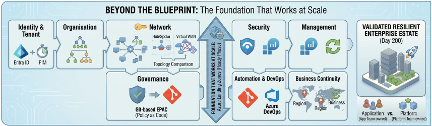
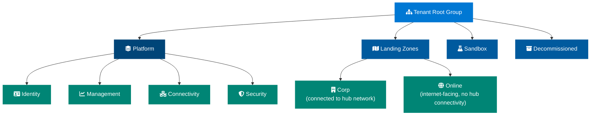
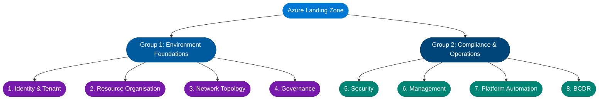

# The Foundation That Can't Afford to Crack

## Azure Landing Zones and the 8 Design Areas

Most Azure projects don't fail :fontawesome-solid-person-running: during migration. They fail **before** it — when the foundation isn't built to hold the weight of what comes next.

Azure Landing Zones are that foundation. But there's a version that most teams build, and there's a version that **actually works at scale** :fontawesome-solid-scale-balanced:. The difference comes down to how deeply you understand — and intentionally design across — the eight core design areas that Microsoft defines as the structural pillars of every enterprise Azure environment.

<!-- more -->

### :material-alert-circle-outline: The Platform Foundation Trap

-   :material-clock-fast:{ .lg .middle } **You built it fast**

    ---

    A VNet, a subscription, a couple of resource groups. It worked for the first workload. Then the tenth. Now you have **42 subscriptions and no one knows who owns what**.

-   :material-shield-alert:{ .lg .middle } **You governed it later**

    ---

    Policy came after the workloads. Defender for Cloud surfaced **hundreds of recommendations** with no process to action them. Compliance reports are red. Auditors are asking questions.

-   :material-network-off:{ .lg .middle } **You scaled the unscalable**

    ---

    The Hub VNet IP range is exhausted. Adding a second region means rebuilding addressing from scratch. What looked like a shortcut was actually **a dead end**.

!!! warning "The missing ingredient isn't a new Azure service. It's a **deliberate, intentional foundation** — designed before the first workload lands."

!!! success "That foundation is the **Azure Landing Zone** — built intentionally across eight design areas, so every workload that follows inherits security, governance, and connectivity automatically."

---

!!! note "Part 2 of the CAF Series"
    This is Part 2 of my ongoing CAF series. [Part 1 A Deep Dive into the Microsoft Cloud Adoption Framework for Azure](AzurecloudAdoption.md). If you haven't read that yet, the short version is this: the **Ready phase** is where you build the platform before workloads arrive. Landing Zones are the Ready phase made real.

Let's go through what that actually means.

---

## First: What a Landing Zone Actually Is

Before diving into the design areas, it's worth clearing up the most common misconception.

!!! warning "Common Misconceptions"
    A Landing Zone is **not** a VNet. It's **not** a subscription. It's **not** an ARM template you run once and move on from.

**A Landing Zone is the entire control plane for your Azure estate.** It's the set of decisions, configurations, guardrails, and automated processes that determine how every workload in your organisation will land, operate, and be governed — before any of those workloads exist.

Think of it less like a building and more like the city planning ordinances, utility infrastructure, and zoning laws that determine what can be built, where, and under what conditions. The buildings (workloads) come later. The planning framework has to exist first.

-   :material-numeric-1-circle:{ .lg .middle } **Policy-Driven**

    ---

    Governance is **enforced automatically**, not reviewed manually. Every new resource lands compliant by default.

-   :material-numeric-2-circle:{ .lg .middle } **Subscription-Scale**

    ---

    Designed to work across **dozens or hundreds of subscriptions** without increasing operational overhead per subscription.

-   :material-numeric-3-circle:{ .lg .middle } **Code-Deployed**

    ---

    Infrastructure as Code — not portal clicks. Every configuration is **version-controlled, reviewable, and repeatable**.

-   :material-numeric-4-circle:{ .lg .middle } **Day-2 Ready**

    ---

    Not just "stands up on Day 1". Designed for **ongoing operations**, expansion, and continual governance maturity.

Microsoft organises this framework around eight design areas — split into two groups.

---

## The 8 Design Areas at a Glance

-   :material-shield-account:{ .lg .middle } **Identity & Tenant**

    ---

    Entra ID tenant structure, RBAC, PIM, and Conditional Access — your first security perimeter.

    [:octicons-arrow-right-24: Jump to section](#1-identity-and-tenant-design)

-   :material-sitemap:{ .lg .middle } **Resource Organisation**

    ---

    Management Groups and Subscriptions as management units, not just billing containers.

    [:octicons-arrow-right-24: Jump to section](#2-resource-organisation)

-   :material-network:{ .lg .middle } **Network Topology**

    ---

    Hub-and-Spoke or Virtual WAN — and why multi-region design matters from day one.

    [:octicons-arrow-right-24: Jump to section](#3-network-topology-and-connectivity)

-   :material-gavel:{ .lg .middle } **Governance**

    ---

    Azure Policy as an enforcement engine, not a reporting checkbox.

    [:octicons-arrow-right-24: Jump to section](#4-governance)

-   :material-shield-lock:{ .lg .middle } **Security**

    ---

    Dedicated security subscriptions, Defender for Cloud, and separation of duties.

    [:octicons-arrow-right-24: Jump to section](#5-security)

-   :material-monitor-eye:{ .lg .middle } **Management**

    ---

    Log Analytics strategy, update management, and platform observability.

    [:octicons-arrow-right-24: Jump to section](#6-management)

-   :material-git:{ .lg .middle } **Platform Automation**

    ---

    IaC, deployment rings, and what the ALZ Accelerator means for your platform.

    [:octicons-arrow-right-24: Jump to section](#7-platform-automation-and-devops)

-   :material-hospital-building:{ .lg .middle } **BCDR**

    ---

    Platform-level resilience decisions that workload teams can't make for themselves.

    [:octicons-arrow-right-24: Jump to section](#8-business-continuity-and-disaster-recovery)

---

## Group One: Environment Foundations

These four design areas form the non-negotiable bedrock. Get any of them wrong and everything built on top is structurally compromised.

### 1. Identity and Tenant Design :material-shield-account:

Identity is your first security perimeter — not your firewall, not your private endpoints. Identity.

This design area covers how your Azure Active Directory (Entra ID) tenant is structured, how identities are provisioned and governed, and how access is controlled across the estate.

!!! info "Key Design Decisions"
    - [x] **Single tenant or multi-tenant?** Most enterprises run a single Entra ID tenant with multiple subscriptions. But regulated industries, M&A scenarios, or strict data residency requirements sometimes warrant separate tenants. This is a **hard-to-reverse decision** — make it deliberately.
    - [x] **RBAC model** — who gets what permissions, at what scope. The answer should never be "Owner at subscription level for everyone who asks." Build a least-privilege model from the start, using Management Groups to apply role assignments at scale rather than subscription by subscription.
    - [x] **Privileged Identity Management (PIM)** — no one should have standing privileged access. PIM enforces just-in-time elevation, so privileged roles are activated on-demand with approval workflows and audit trails, not permanently assigned.
    - [x] **Conditional Access** — the policies that determine when and how identities are trusted. Require MFA. Enforce compliant device states. Block access from unexpected geographies. These aren't optional extras; they're baseline hygiene.

!!! warning "Common Pitfall"
    The common mistake here is treating identity as an IT operations concern rather than an architecture one. By the time the platform team is involved, the identity decisions have often already been made — badly.

---

### 2. Resource Organisation :material-sitemap:

This is where most Landing Zone implementations look reasonable on the surface and fall apart at scale.

Resource organisation in Azure centres on two constructs: **Management Groups** and **Subscriptions**. The key insight — one that teams consistently miss — is that these are *management* boundaries, not billing containers.

!!! abstract "The Subscription Insight"
    A subscription is not just a way to get an invoice. It's a **unit of isolation**, a **policy boundary**, a **blast radius limiter**. The question isn't "how many subscriptions do we need?" — it's "what is each subscription responsible for, and who owns it?"

The Microsoft recommended hierarchy looks like this:

Each node in this hierarchy is a Management Group. Policies and role assignments applied at a Management Group scope are inherited by everything beneath it. This is how you enforce governance at scale without managing each subscription individually.

!!! tip "Name It Right, Name It Once"
    The naming convention you choose here will outlive every member of your current team. Invest time in it, document it, and enforce it through automation.

---

### 3. Network Topology and Connectivity :material-network:

Network architecture is where the most passionate debates in Azure happen — and where the consequences of a wrong decision are the most expensive to fix.

The two primary models are **Hub-and-Spoke** (using Azure Virtual Network Peering) and **Azure Virtual WAN** (Microsoft's managed network fabric). Choosing between them depends on your scale, your branch connectivity requirements, and how much operational complexity your team can absorb.

=== ":material-hub: Hub-and-Spoke"
    - Full control and well-understood topology
    - Central Hub VNet hosts **Azure Firewall**, **VPN/ExpressRoute gateways**, and **DNS**
    - Spoke VNets peer to the Hub and inherit connectivity
    - Simple, proven, and the right choice for most organisations under a certain scale threshold

=== ":material-train-car-container: Azure Virtual WAN"
    - The answer when you have dozens of branches, multiple regions, and complex routing requirements
    - Abstracts the routing complexity but reduces your ability to customise
    - Ideal for enterprises with strict branch connectivity and multi-region requirements

!!! info "Universal Principles — Regardless of Which You Choose"
    - [x] **Design for multi-region from day one**, even if you start in a single region. The decisions you make about IP addressing, peering topology, and gateway placement will determine whether adding a second region is straightforward or nightmarish. Treat region expansion as inevitable.
    - [x] **IPAM is infrastructure.** IP address management is not something you solve with a spreadsheet. As subscriptions are created (often through a Subscription Vending Machine — more on that in Part 3 of this series), IP ranges need to be allocated automatically, without overlap. Build IPAM into your platform from the start.

---

### 4. Governance :material-gavel:

Governance is the design area most organisations treat as a checkbox and most mature platforms treat as a discipline.

In Azure, governance is primarily delivered through **Azure Policy**. Policies define the rules your environment must follow — which regions resources can be deployed to, what tags are required, which resource types are allowed, what security configurations are mandatory.

!!! success "The Critical Mindset Shift"
    **Azure Policy is not a reporting tool. It's an enforcement engine.**

Policies can operate in three modes:

| Mode | Behaviour |
|------|-----------|
| **Audit** | Flags non-compliant resources but allows them to exist |
| **Deny** | Prevents non-compliant resources from being created |
| **DeployIfNotExists / Modify** | Automatically remediates non-compliance by deploying or modifying resources |

!!! warning "A Governance Model Built on Audit Alone"
    A governance model built only on Audit policies is a governance model built on hope. The goal is to move your most important controls to **Deny** and **DeployIfNotExists**, so the platform enforces compliance automatically rather than relying on humans to read reports and act on them.

We'll go much deeper on Policy-as-Code and the EPAC framework in Part 3.

---

## Group Two: Compliance and Operations

These four design areas determine how your environment is kept secure, observable, and resilient once workloads start arriving.

### 5. Security :material-shield-lock:

Security in a Landing Zone context is about architecture, not just tooling.

!!! abstract "The Dedicated Security Subscription"
    The most important structural decision is the **dedicated Security subscription**. In the Microsoft reference architecture, a separate subscription hosts:

    - **Microsoft Sentinel** (your SIEM)
    - The **Log Analytics Workspace** that aggregates security signals across the estate
    - The **Microsoft Defender for Cloud** configuration

    **Why separate?** Separation of duties. Your security team should have visibility across everything without having management permissions over workloads. A dedicated security subscription lets you grant the security team exactly what they need — read access to logs, ability to create analytics rules, access to Defender recommendations — without giving them the ability to accidentally (or intentionally) modify production workloads.

!!! note "Non-Negotiable"
    **Defender for Cloud enabled at the Management Group level**, so every new subscription is automatically enrolled. Not subscription by subscription, on request. Automatically, on creation.

---

### 6. Management :material-monitor-eye:

You can't manage what you can't see. This design area is about making your estate observable.

!!! info "Log Analytics Workspace Strategy"
    The centrepiece is your **Log Analytics Workspace strategy**. Where you place your central workspace matters more than most people expect:

    - [x] Should live in the dedicated **Management subscription**, not in a workload subscription
    - [x] Should ingest **platform logs** (Activity Log, Azure Diagnostics), VM performance data, and security signals
    - [x] Should be the **single source of truth** that every other monitoring tool — Sentinel, Defender for Cloud, Azure Monitor — reads from

Beyond observability, this design area covers:

- **Update management** — how patches are deployed across VMs at scale
- **Backup policy** — what's protected, at what frequency, with what retention
- **Change tracking** — knowing what changed in your environment and when

!!! failure "The Failure Mode: Distributed Observability"
    Each team managing their own Log Analytics Workspace, their own alerting, their own backup vaults. This looks like team autonomy. It is actually **platform blindness**.

---

### 7. Platform Automation and DevOps :material-git:

Your Landing Zone should be deployed and maintained through code, not portal clicks. This design area defines how.

The two most common choices are **GitHub Actions** and **Azure DevOps Pipelines**. Both can do the job. The more important question is how you structure your pipelines for safety.

The pattern Microsoft recommends is a **staged deployment approach**, where every platform change travels through a controlled sequence of environments before it reaches production. Here is how that works in practice:

```mermaid
flowchart LR
    CHANGE["fa:fa-code-branch Platform Change\nPolicy / IaC / Network"]

    SANDBOX["fa:fa-flask Step 1\nValidate in Sandbox\nLow-risk · Isolated · Safe to break"]
    NONPROD["fa:fa-vial Step 2\nNon-production Corp\nDev/Test · Limited blast radius"]
    GATE["fa:fa-shield-halved Step 3\nApproval Gate\nManual sign-off or compliance check"]
    PROD["fa:fa-circle-check Step 4\nProduction\nCorp & Online subscriptions"]

    CHANGE --> SANDBOX
    SANDBOX -->|"Validated ✓"| NONPROD
    NONPROD -->|"Validated ✓"| GATE
    GATE -->|"Approved ✓"| PROD

    classDef start  fill:#0078D4,color:#fff,stroke:#0078D4,stroke-width:2px;
    classDef safe   fill:#008575,color:#fff,stroke:#008575;
    classDef gate   fill:#7719AA,color:#fff,stroke:#7719AA;
    classDef prod   fill:#004578,color:#fff,stroke:#004578;

    class CHANGE start;
    class SANDBOX,NONPROD safe;
    class GATE gate;
    class PROD prod;
```

**Step 1 — Validate in Sandbox first.**
Every change — whether it's a new Policy definition, a Terraform module update, or a change to your Hub VNet configuration — is deployed to the Sandbox Management Group first. Sandbox subscriptions are low-risk, isolated, and exist specifically to absorb the unexpected. If something breaks here, nothing outside the sandbox is affected and you fix it before it travels any further.

**Step 2 — Promote to non-production Corp subscriptions.**
Once the change has been validated in Sandbox, it moves to your non-production Landing Zone subscriptions — the environments where development and test workloads run. This is your second safety net. It's closer to production in configuration but still carries limited blast radius. Application teams may notice the change here, which is also useful — they can flag issues before production is touched.

**Step 3 — Gate before production.**
Before the change moves to production, introduce a deliberate approval gate. This can be a manual sign-off in your pipeline, an automated compliance check, or both. The gate exists to force a conscious decision: *has this change been sufficiently validated and are we confident it is safe to proceed?* Skipping the gate should require an explicit override, not be the default path.

**Step 4 — Deploy to production Corp and Online subscriptions.**
Only after passing the gate does the change reach your production workload subscriptions. At this point, the change has been through two environments, reviewed, and signed off. The risk of an unexpected impact is as low as it can reasonably be.

This sounds methodical — because it is. The majority of Landing Zone implementations skip this entirely and deploy platform changes directly to production. That works fine until it doesn't, and when it doesn't, the impact is across every workload in the estate simultaneously.

!!! warning "IaC Module Deprecation — Act Now :material-alert:"
    This design area also covers the tooling decision for Infrastructure as Code. The Terraform `terraform-azurerm-caf-enterprise-scale` module — the module most teams built their Landing Zones on — is now in extended support and will be archived on **1 August 2026**. If you're on it, your migration path is the **Azure Landing Zone (ALZ) IaC Accelerator** using Azure Verified Modules (AVM). This is not a future concern. Plan for it now.

---

### 8. Business Continuity and Disaster Recovery :material-hospital-building:

BCDR is the design area most teams think belongs to individual workload teams — and they're half right. Workload-specific recovery objectives absolutely belong to the workload teams. But the *platform* decisions that determine whether those objectives are achievable belong here.

!!! info "Platform-Level BCDR Questions"
    - [x] **Which Azure regions are your primary and secondary?** This should be a platform decision, not a workload-by-workload choice.
    - [x] **Are your shared services (Hub VNet, DNS, Firewall) resilient across regions?** If your Hub goes down, do all your Spoke workloads lose connectivity simultaneously?
    - [x] **How are management plane dependencies handled during a region failure?** Can your platform team still operate if the primary region is unavailable?

!!! failure "The Retrofitting Trap"
    The common failure mode is retrofitting BCDR per workload after go-live, discovering that the platform architecture makes multi-region resilience prohibitively expensive, and then living with single-region risk indefinitely.

---

## Platform Landing Zones vs. Application Landing Zones

Before closing, there's a distinction that is simple to explain and consistently misunderstood in practice — and confusing it causes more governance chaos than almost any other Landing Zone mistake.

-   :material-server-network:{ .lg .middle } **Platform Landing Zones**

    ---

    The shared services subscriptions — **Connectivity** (Hub), **Identity**, and **Management**.

    Owned and operated by the **platform team**. They exist to serve the application teams.

-   :material-application-braces:{ .lg .middle } **Application Landing Zones**

    ---

    The workload subscriptions — **Corp** and **Online** — where application teams deploy their actual workloads.

    Built *on top of* the platform foundation. They inherit governance, networking, and the security baseline.

!!! danger "The Line You Must Not Cross"
    The mistake is treating them as the same thing. When a platform team gives an application team Owner access to the Connectivity subscription "just to sort out the peering," you no longer have a Platform Landing Zone. You have a shared resource with unclear ownership and no blast radius control.

    **The rule is simple:** platform team owns platform subscriptions, application team owns application subscriptions. Crossing that line is where entropy enters the system.

---

## The 8 Design Areas: Quick Reference

| # | Design Area | Key Design Decisions | Most Common Mistake |
|---|-------------|----------------------|---------------------|
| 1 | :material-shield-account: **Identity & Tenant** | Single vs multi-tenant, RBAC model, PIM, Conditional Access | Identity decisions delegated to IT Ops, not made by architecture |
| 2 | :material-sitemap: **Resource Organisation** | Management Group hierarchy, subscription design, naming convention | Treating subscriptions as billing containers, not management units |
| 3 | :material-network: **Network Topology** | Hub-and-Spoke vs Virtual WAN, multi-region IPAM, DNS strategy | Designing for a single region and discovering it doesn't extend |
| 4 | :material-gavel: **Governance** | Policy initiative structure, Deny vs Audit vs DINE modes | Governance built entirely on Audit — compliance enforced by hope |
| 5 | :material-shield-lock: **Security** | Dedicated security subscription, Sentinel placement, Defender enrolment | Security team granted Owner on workload subscriptions for "convenience" |
| 6 | :material-monitor-eye: **Management** | Central Log Analytics workspace, update management, backup policy | Distributed workspaces per team — no central platform observability |
| 7 | :material-git: **Platform Automation** | IaC toolchain choice, deployment rings, ALZ Accelerator adoption | Platform changes applied directly to production with no deployment gates |
| 8 | :material-hospital-building: **BCDR** | Primary/secondary region pair, platform-level resilience, hub redundancy | BCDR retrofitted per-workload post go-live when cost is already prohibitive |

---

## The 8 Design Areas: Architecture View

---

## Stop Building on Sand. Start with the Foundation.

If your Azure environment feels like it's outgrowing your ability to control it, it probably is. The eight design areas aren't a compliance checklist — they are the architectural decisions that determine whether your platform can absorb growth, enforce security, and remain operable at scale.

Getting them right is harder than spinning up a VNet. But getting them wrong is harder still — because you'll be paying the cost of that decision for every workload that lands after it.

-   :material-layers-triple:{ .lg .middle } **Design Once, Enforce Always**

    ---

    The power of a Landing Zone is that **you make the hard decisions once** at the platform level — and every workload inherits them automatically, without asking.

-   :material-arrow-decision:{ .lg .middle } **Decisions Are Cheap Now**

    ---

    Reversing a Management Group hierarchy with 200 subscriptions underneath it is expensive. Reversing it **before workloads arrive is a 30-minute conversation**.

-   :material-shield-half-full:{ .lg .middle } **Platform Owns the Baseline**

    ---

    Security, observability, and BCDR guardrails belong to the **platform team, not individual workload teams**. That's what makes them consistent — and enforceable.

**Your Landing Zone maturity starts with these eight design areas. Get them right before the workloads arrive.**

---

### What's Next in This Series

Getting these eight design areas right is the work of the Ready phase. But a Landing Zone built once and never maintained is a Landing Zone that decays.

In Part 3, I go into what happens on Day 200 — when ClickOps, expansion fatigue, and policy stagnation start to unravel everything you built — and how **Subscription Vending Machines** and **Enterprise Policy as Code** keep your environment as clean on Day 200 as it was on Day 1.

[Read Part 3: Beyond the Blueprint — How Landing Zones Decay (And How to Stop It)](LandingZoneDrift.md)

---

*This is Part 2 of my ongoing series on the Microsoft Cloud Adoption Framework. [Part 1 introduced the six CAF phases](AzurecloudAdoption.md). Coming up in Part 4: Governance — Azure Policy as Code without killing developer agility.*

---

### :material-book-open-variant: References

- :material-microsoft-azure: [Azure Landing Zones — Official Documentation](https://learn.microsoft.com/en-us/azure/cloud-adoption-framework/ready/landing-zone/)
- :material-microsoft-azure: [Azure Landing Zone Design Areas](https://learn.microsoft.com/en-us/azure/cloud-adoption-framework/ready/landing-zone/design-areas)
- :material-microsoft-azure: [Azure Landing Zone Accelerator](https://learn.microsoft.com/en-us/azure/architecture/landing-zones/landing-zone-deploy)
- :material-microsoft-azure: [Azure Verified Modules (AVM)](https://azure.github.io/Azure-Verified-Modules/)
- :material-microsoft-azure: [Microsoft Entra ID — Privileged Identity Management](https://learn.microsoft.com/en-us/entra/id-governance/privileged-identity-management/pim-configure)
- :material-microsoft-azure: [Azure Policy Overview](https://learn.microsoft.com/en-us/azure/governance/policy/overview)